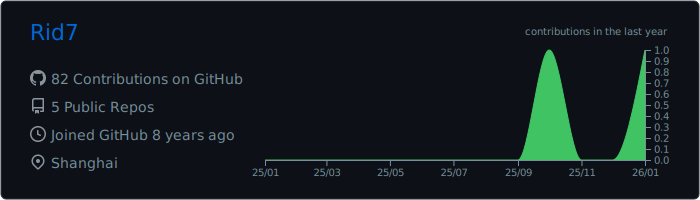
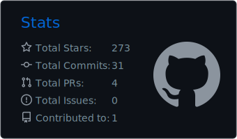

# 👋 Hi, I'm Riddance 

---

## 🎯 Learning Scope

<table>
  <tr>
    <td>🧠 Deep Learning</td>
    <td>📊 Data Science</td>
  </tr>
  <tr>
    <td>📈 Quantification</td>
    <td>🐍 Python Backend</td>
  </tr>
</table>

---

## 📊 GitHub Stats

---

## ⭐ Highlights

---

💡 *Parameter tuning and more than parameter tuning*

